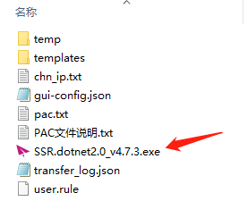
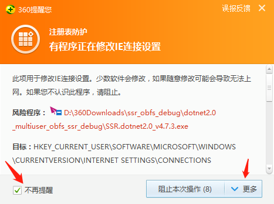
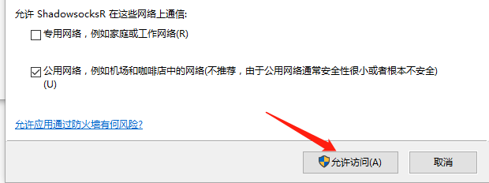
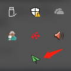
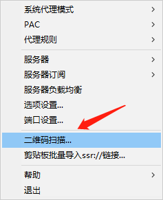
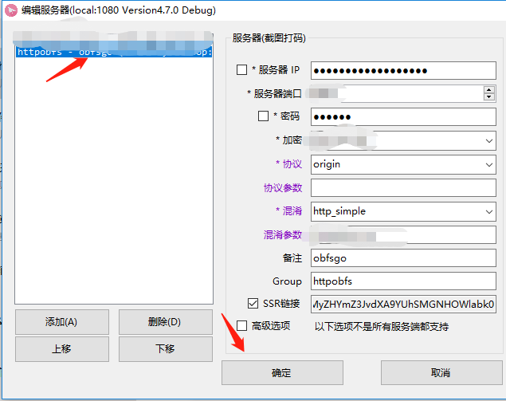
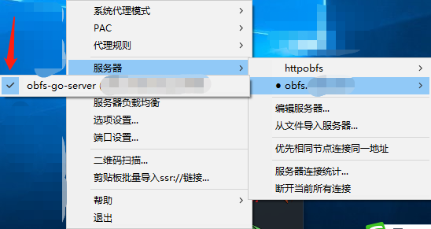

# 新版obfs（xbfs） Windows 配置教程
老版本的obfs混淆现在经常被GFW探测到，用一段时间就GG.于是有技术大佬研究了GFW的探测原理，升级了一版新的混淆协议，目前仅支持windows7/8/10系统，其他系统敬请期待！

为方便表述，我们称此版本混淆为**xbfs**

### Windows傻瓜式配置xbfs
主要分为以下步骤，预计将花费30秒-3分钟。

  - 下载合适的客户端版本并解压
  - 扫码添加服务器xbfs账号
  - 畅游连上国际网络

**详细步骤如下**

- windows 客户端下载（需安装.net2.0或.net4.0环境，**建议使用dotnet4.0版本**）
	* 以下为.net2.0 rar/zip下载包。适用于windows 7/8
    	- [ssr dotnet2.0 zip下载](https://github.com/itrump/ssfree/raw/master/files/obfs_client/ssr_dotnet2.0_obfs_4.7.5_release.zip)
   		- [ssr donet2.0 rar下载](https://github.com/itrump/ssfree/raw/master/files/obfs_client/ssr_dotnet2.0_obfs_4.7.5_release.rar)
  	* .net4.0 的rar/zip下载包。适用于windows 8/10
    	- [ssr donet4.0 zip下载](https://github.com/itrump/ssfree/raw/master/files/obfs_client/ssr_dotnet4.0_obfs_4.7.5_release.zip)
    	- [ssr donet4.0 rar下载](https://github.com/itrump/ssfree/raw/master/files/obfs_client/ssr_dotnet4.0_obfs_4.7.5_release.rar)
- 下载后解压、启动客户端
	* 解压到文件夹后，看到如下截图中的多个文件。双击打开红色纸飞机图标`SSR`（`ShadowsocksR`）可执行文件
	* 
	* 打开过程中，360可能会报风险提示，勾选『不再提醒』并在『更多』中选择『允许程序所有操作』
	* 
	* windows会提示网络访问，直接『允许访问』即可
	* 
- 扫描二维码添加服务器配置
	
	* 准备二维码。将网络流量商提供的二维码打开放在屏幕正中间。
	* 
	* 先关闭所有其他的代理客户端！再打开`SSR`客户端，状态栏中出现一个纸飞机图标，右击该图标，弹出一个菜单栏。
	* 
	* 
	* 点击『二维码扫描』
	* 扫描成功，弹出服务器配置对话框，点击确定。
	* 
	* 再次右击『纸飞机』图标，在菜单栏中选择『服务器』->『新添加的服务器组xx』->『新添加的服务器名xx』。`xx`代表服务器账号备注的相关名字。
	* 

- 至此为止，如果上述过程没有提示错误，已经全部配置完成。打开浏览器，畅游国际网络吧！
	* 

### xbfs混淆特性
 - 客户端兼容ss/ssr原有所有协议
 - 弱化了user->port的映射关系（非常容易被GFW探测到）
 - 增强了大流量下的多用户混淆功能，防探测功能

***注意***
> xbfs相比老版本增加了单端口多用户同时混淆的功能，兼容老版本(ss/ssr)的混淆功能。若要用xbfs混淆，请升级至上述列出的新版客户端。