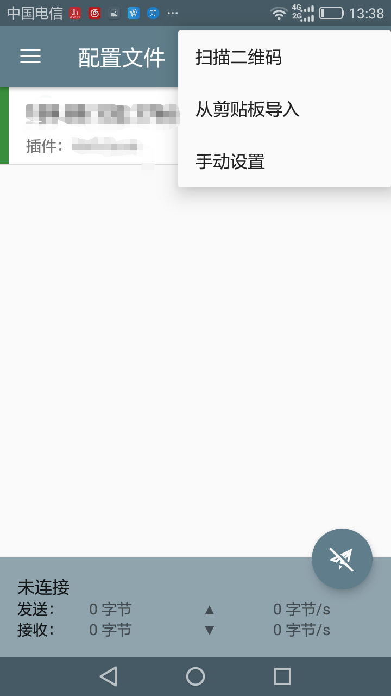
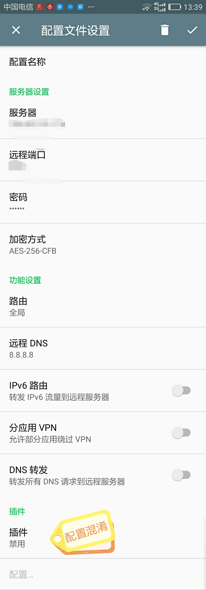
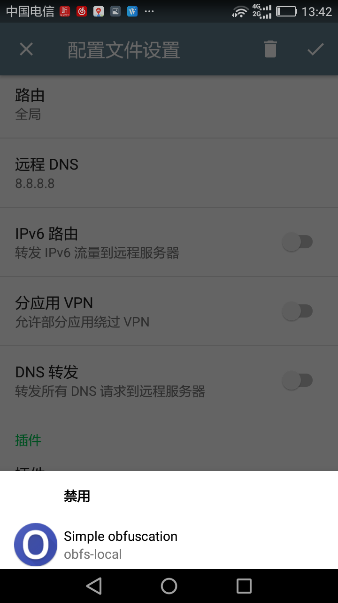
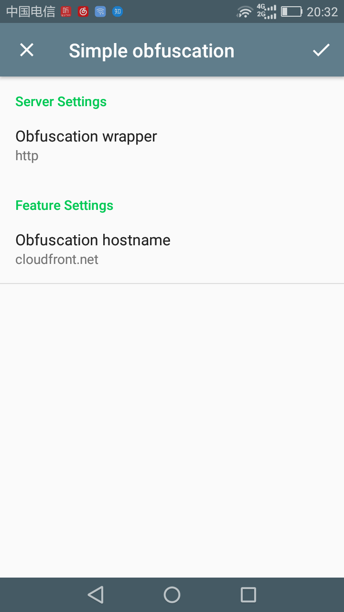
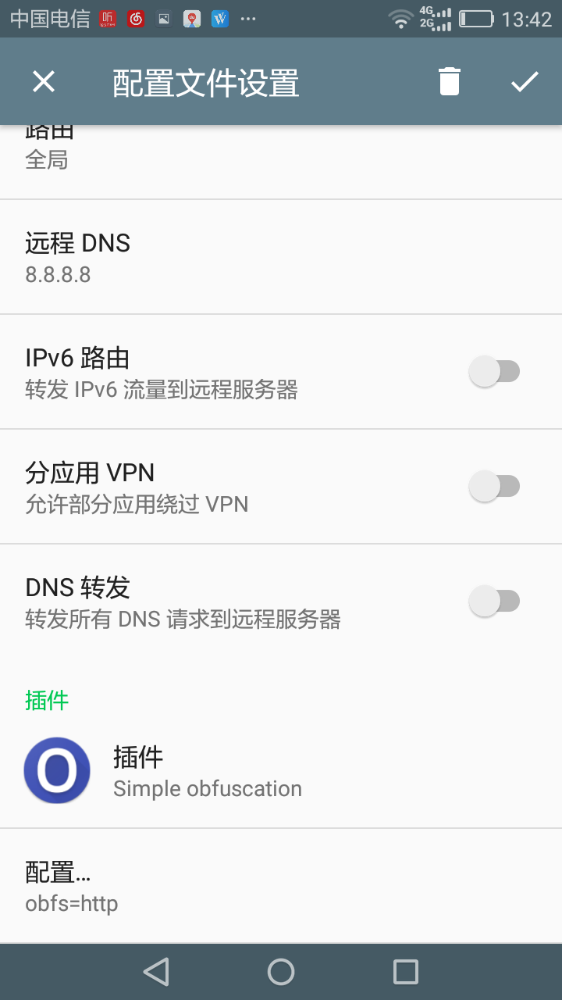
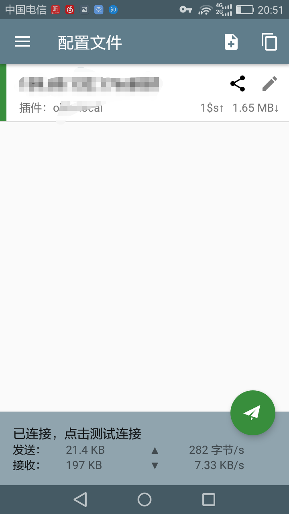

# Android ss obfs配置教程

主要分以下几步即可轻松搞定安卓客户端shadowsocks的obfs设置，图文描述显得略长，操作1分钟内搞定！

- 下载最新版安卓shadowsocks客户端、obfs插件两个文件并安装
- 扫码添加ss配置，配置obfs混淆参数

## 下载新版客户端及obfs插件

- 新版带obfs功能[Android shadowsocks下载](https://github.com/itrump/ssfree/raw/master/files/obfs_client/shadowsocks-nightly-4.3.0.apk)
- shadowsocks安卓[obfs插件下载](https://github.com/itrump/ssfree/raw/master/files/obfs_client/obfs-local-nightly-0.0.5.apk)

**注意：以上版本兼容，若下载其他版本可能出现不兼容！**

下载好后，安装时若弹出提示，需要选择信任此应用。

## 扫码添加ss配置

- 打开shadowsocks，点右上角的'+'按钮，选择「扫描二维码」，若不嫌麻烦也可选「从剪切板导入」或「手动设置」（手动填容易出错导致连接错误！）
  - 

## 配置obfs混淆
「」
- 在扫码后跳转的页面最下方有个「插件」选项，点击后选择「Simple obfuscation」
  - 
  - 
- 在插件下查看「配置」，确认选项默认的值为「http」和「cloudfront.net」即可，其中「cloudfront.net」可替换为其他国外可访问的http网址如「www.bing.com」
  - 
  - 保存后回到账号配置界面
  - 
- 保存配置，回到主界面，点击右下角「启动按钮」启动客户端，「启动按钮」变绿后打开浏览器即可访问谷歌。
  - 
- 看看是不是看到了一个漂亮的谷歌图标:)
  - 

## 可能的问题FAQ
- 安卓安装提示错误
  - 请升级安系统卓版本
- 提示插件加载出错
  - 可能是「接触不良」,请退出客户端后，重新打开按上述过程配置试试

## [联系我们](./联系我们.md)
