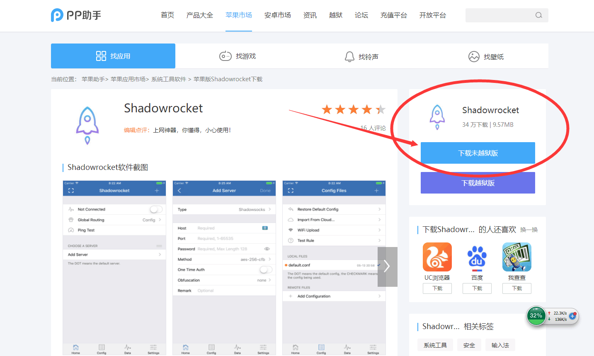
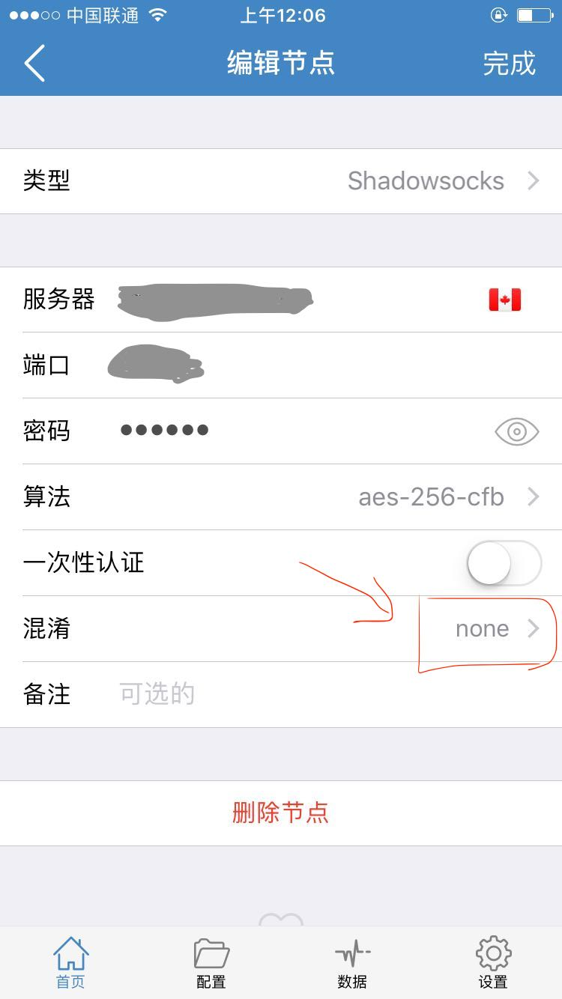
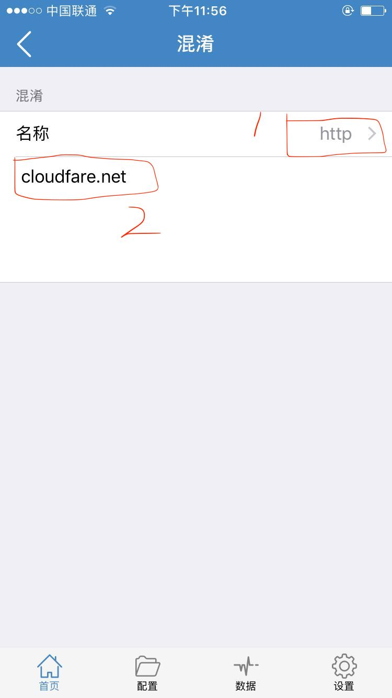
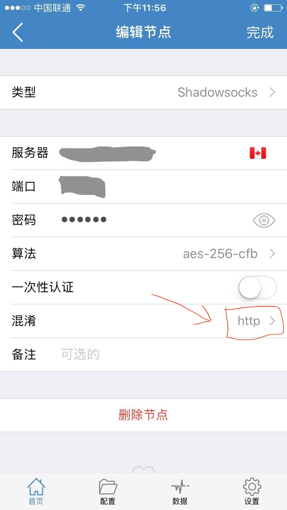
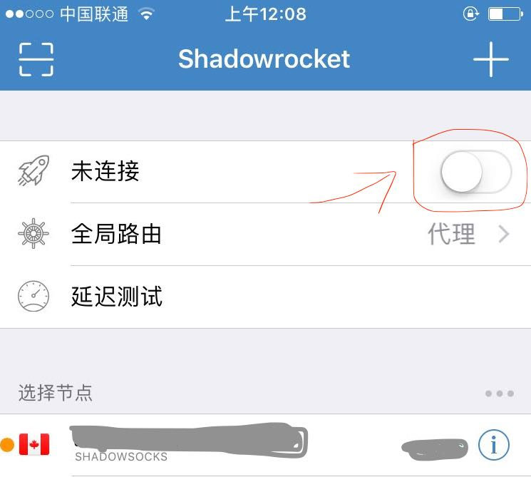

# Iphone/Ipad ss obfs配置教程
Iphone / ipad 的obfs配置类似，下面以iphone为例。傻瓜式教程，操作1分钟内可搞定！

- 安装shadowrocket
- 扫码添加ss账号并配置obfs混淆

## 安装shadowsocket
国区已下架，现在没找到好的方法安装。有好方法请私telegram我。所以只针对安装好了iphone/ipad的小火箭的朋友进行下一步了。

 > 从[pp助手上](https://www.25pp.com/ios/detail_1923429/)下载
 
 打开上面链接后，右侧『下载未越狱版』和『下载越狱版』，需要iphone连接电脑。具体可以详细咨询用过pp助手的朋友。
 
 

## 添加ss账号并配置obfs混淆

- 扫码添加配置
  - 在shadowrocket找到扫码按钮，扫描添加账号。添加后跳转到「账号详情界面」。
  - 
- 配置obfs混淆
  - 扫码后跳转到账号配置详情页，点混淆后，跳转到混淆配置界面。
  - 
  - 需配置两项
    - 名称，选```http```
    - 参数，填```couldfare.net```
  - 配置好后，返回「账号详情界面」，混淆显示```http```
    - 
  - 点「完成」保存配置并回到主界面
- 主界面中选择刚配置的节点，启用带obfs混淆的shadowrocket
  - 
- 打开浏览器，看看谷歌是不是可以访问了？骚年，开始畅游世界互联网吧！
  - 

## [联系我们](./联系我们.md)
