# Mac OS x ss obfs配置教程

Mac OS x的shadowsocks obfs混淆教程有点trick，已更新初版！

需要

- 安装 mac ShadowsocksX-NG 以及 obfs-local，
- 扫码配置ss 及 配置obfs混淆

### 详细步骤
#### 说明：
 - 对于小白来说有点难度，但只要细心按教程一步一步操作，还是不难的。

 - 如果一遍不行，再多操作几遍试试，仍然不行，把mac仍了，换用windows吧。摊手-:

 - 教程中是客户端英文版，如果打开客户端是中文版，找到对应的菜单、按钮操作即可。

 - 教程中涉及的命令行，请按原样复制到命令行终端，以免手动敲错！

#### 手把手开始操作
- 安装ss客户端，如果已经安装过的可直接跳过。
  - mac ss客户端下载
    - [mac ss rar压缩文件下载](https://github.com/itrump/ssfree/raw/master/files/obfs_client/s-s.ng.mac.1.7.0.rar)
    - [mac ss zip压缩文件下载](https://github.com/itrump/ssfree/raw/master/files/obfs_client/s-s.ng.mac.1.7.0.zip)
  - 下载后解压缩安装，安装或打开过程按提示输入密码。
    - 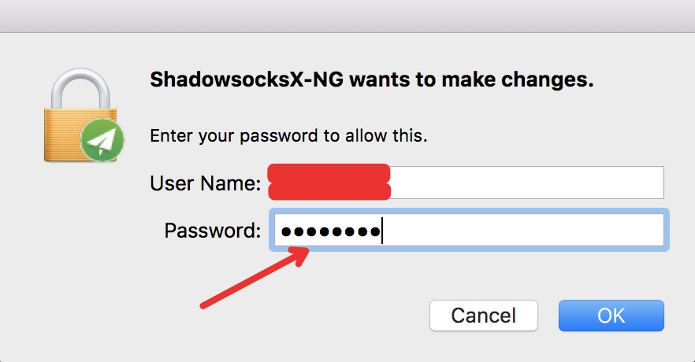

- 扫码添加ss + obfs 的二维码配置
  - 打开客户端后，找到菜单里的'从屏幕扫描二维码'选项，同时打开个人中心标识'ss + obfs' 的二维码（敲黑板：不是纯ss二维码），添加配置
    - 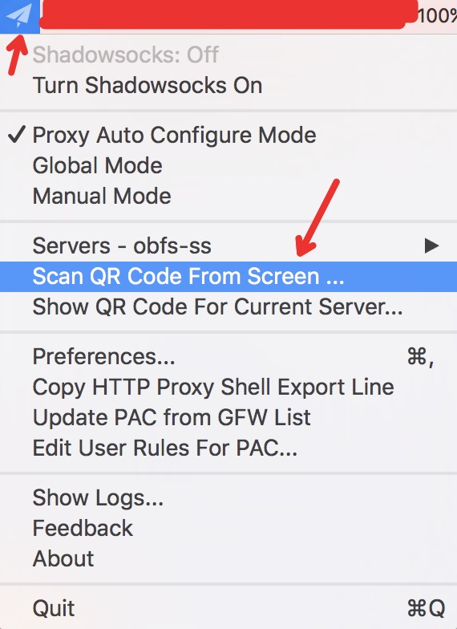
  - 扫码成功后再打开菜单，发现添加了新的账号，点击查看「服务器配置...」/'Server Preferences...'
    - 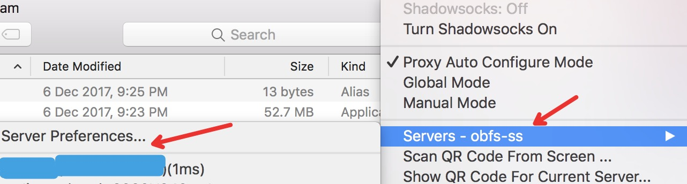
  - 可看到服务器信息如下
    - 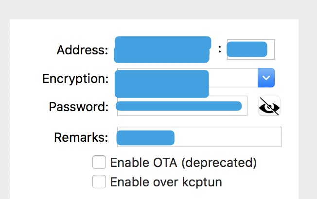
  - ok，至此已经把账号信息添加好了50%。

- 安装mac obfs客户端
  - 打开mac命令行（小白听到命令行也别怕，这玩意隔壁老王家5岁小孩教了一遍也会玩了）
    - 按F4，跳出mac面板，找到『其他』图标
      - 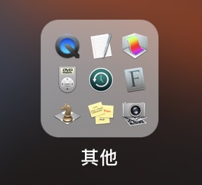
    - 找到terminal图标，并点击打开，即打开了命令行
      - 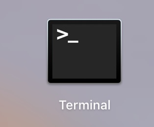
  - 安装homebrew
    - 输入以下命令，并按'回车/Enter'
      - 输入以下命令安装homebrew（部分用户无法访问git内容，下面的命令会在过程中卡住不动，请换个运营商网络重试。后续将建个国内镜像解决此问题）
      - ```ruby -e "$(curl -fsSL https://raw.githubusercontent.com/Homebrew/install/master/install)"```
      - 命令执行过程中，会出现一句提示是否继续```Press RETURN to continue or any other key to abort```，按'回车/Enter'确认继续。执行结果输出如下图
        - 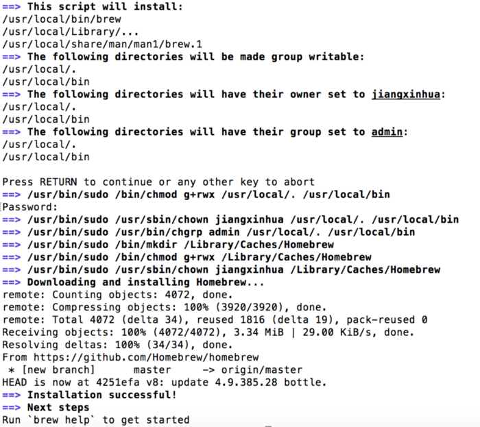
        - 过程中提示```Password:```，输入密码即可。
      - 输入以下命令确认安装成功
      - ```brew help```
      - 会输出homebrew的帮助信息
        - 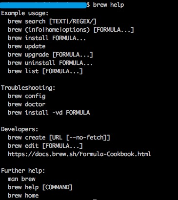
  - 用homebrew安装simple-obfs插件
    - 输入以下命令，并按'回车/Enter'
      - ```brew install simple-obfs```
      - 安装过程是自动的，会输出一些下载、源地址等信息，等待自动安装完成即可。
      - ```obfs-local```
      - 安装完后，输入上述命令，屏幕会输出obfs工具帮助提示信息如下，即表示obfs命令行客户端工具下载安装完成
        - 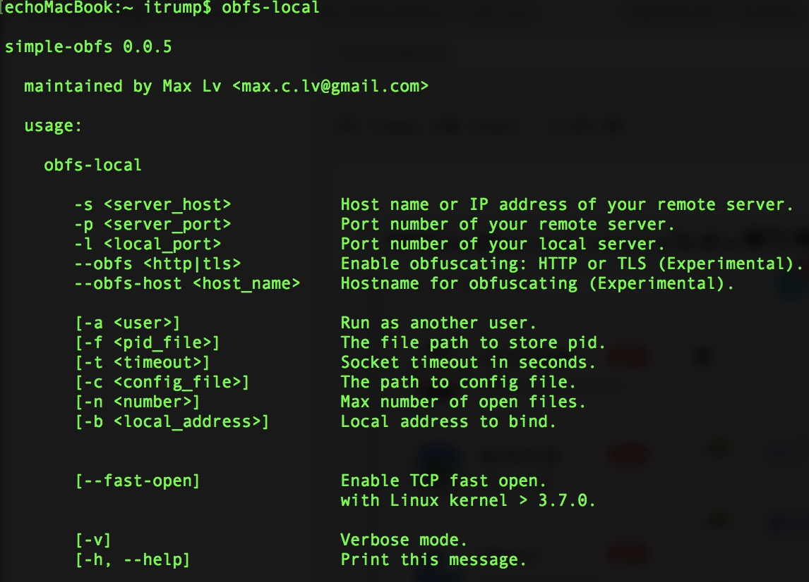
    - 如果上面的命令行提示出错，或命令没反应，请回到上一步检查之前的homebrew工具、simple-obfs是否安装成功！

- 启动obfs程序（每个命令按Enter前，请再次确认是不是准确无误！）
  - 打开mac命令行（小白听到命令行也别怕，这玩意隔壁老王家5岁小孩教了一遍也会玩了）
    - 按F4，跳出mac面板，找到『其他』图标
      - 
    - 找到terminal图标，并点击打开，即打开了命令行
      - 
    - 启动obfs程序，将ss流量重定向到obfs
      - 复制下面的命令行模板
      - ```obfs-local -s SERVER_HOST -b 127.0.0.1 -p SERVER_PORT -l 8388 --obfs http --obfs-host www.bing.com -f /tmp/obfs-local.8388.pid```
      - 上面这条命令有点长，而且有两处```SERVER_HOST``` 和```SERVER_PORT```需要替换。先复制下来，粘贴到命令行，**先不用敲回车执行**，万一不小心已经回车了，请参考文后的「关闭obfs」，先关闭再启动obfs。
      - 找到上面步骤中ss客户端已经扫码的服务器配置，获取```SERVER_HOST``` 和```SERVER_PORT```，
        - 右键打开ss客户端菜单->'服务器配置...'/ 'Server Preferences...' -> 服务器配置信息如截图
        - 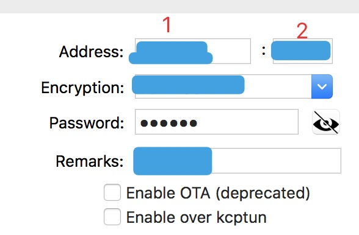
        - 将```SERVER_HOST```替换为图中 1 的服务器地址，```SERVER_PORT```替换为图中 2 的端口
          - 例如图中服务器地址为 abc.def.com 端口为 10088，则替换后的最终命令为：
          - ```obfs-local -s abc.def.com -b 127.0.0.1 -p 10088 -l 8388 --obfs http --obfs-host www.bing.com -f /tmp/obfs-local.8388.pid```
        - 确认替换无误后，按下 '回车 / Enter' 执行，正常情况下不会输出任何信息。
     - 确认 obfs 程序已启动
        - 运行命令确认
          - ``` ps -ef | grep obfs-local  | grep -v grep```
          - 输出内容包含上面替换后的那串命令字串，则表示启动成功！
          - 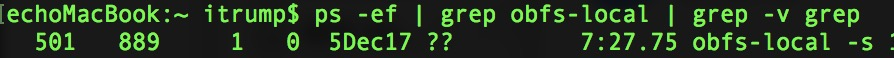
- 重定向ss流量，并启动ss客户端
  - 右键打开ss客户端菜单->'服务器配置...'/ 'Server Preferences...' -> 服务器配置信息如截图
    - 
    - **找到之前扫码的那个服务器配置**，（敲黑板：是上面扫码添加过的服务器配置！）修改服务器地址为```127.0.0.1```，端口为```8388```，其他不变
      - 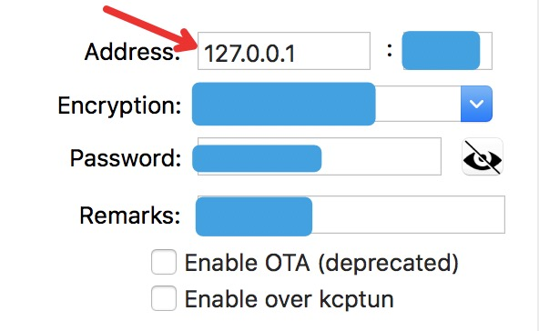
    - 确认保存
      - 
  - 至此已经将ss客户端流量转发到obfs，连通了ss + obfs，启动ss客户端即可畅游外网了
  - 右键打开ss客户端菜单，启动ss客户端
    - 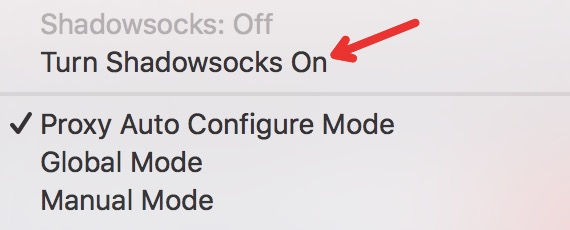

- 打开浏览器，看看谷歌是不是可以访问了？骚年，开始畅游世界互联网吧！
  - 

- 写完发现，太复杂了，如果你按教程操作成功了，恭喜你，你拥有考入北大清华的智商！如果没有成功，那也别气馁，找个身边的程序员哥哥帮你30秒搞定。

#### 其他
- 关闭ss + obfs
  - 关闭ss 客户端
    - 右键找到ss客户端菜单中关闭按钮
  - 关闭obfs，如果上述步骤执行成功，不关机可不理会obfs程序在后端运行：因其占用内存、电量等资源极少。如果重新开机了需重新启动obfs程序。
    - 命令行
      - ``` ps -ef | grep obfs-local  | grep -v grep```
      - 
      - 找到输出内容的第二列，上面截图中第二列为889
      - ```kill -9 889```
      - 再次运行上面的第一个命令行，发现已经没有输出，说明已经将程序关闭。

## [联系我们](./联系我们.md)
