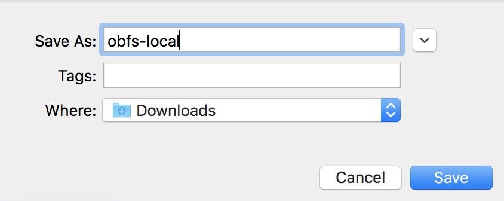
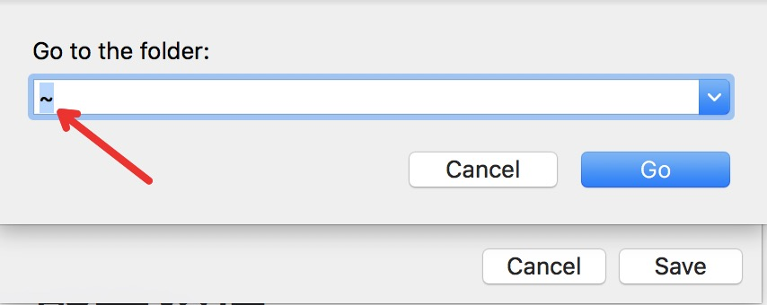
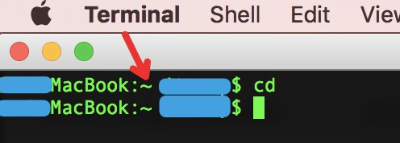

# Mac OS x ss obfs配置教程

Mac OS x的shadowsocks obfs混淆教程有点trick，已更新初版！

需要

- 安装 mac ShadowsocksX-NG 以及 obfs-local，
- 扫码配置ss 及 配置obfs混淆

### 详细步骤
#### 说明：
 - 对于小白来说有点难度，但只要细心按教程一步一步操作，还是不难的。

 - 如果一遍不行，再多操作几遍试试，仍然不行，把mac仍了，换用windows吧。摊手-:

 - 教程中是客户端英文版，如果打开客户端是中文版，找到对应的菜单、按钮操作即可。

#### 手把手开始操作
- 安装ss客户端，如果已经安装过的可直接跳过。
  - mac ss客户端下载
    - [mac ss rar压缩文件下载](https://github.com/itrump/ssfree/raw/master/files/obfs_client/s-s.ng.mac.1.7.0.rar)
    - [mac ss zip压缩文件下载](https://github.com/itrump/ssfree/raw/master/files/obfs_client/s-s.ng.mac.1.7.0.zip)
  - 下载后解压缩安装，安装或打开过程按提示输入密码。
    - 

- 扫码添加ss + obfs 的二维码配置
  - 打开客户端后，找到菜单里的'从屏幕扫描二维码'选项，同时打开个人中心标识'ss + obfs' 的二维码（敲黑板：不是纯ss二维码），添加配置
    - 
  - 扫码成功后再打开菜单，发现添加了新的账号，点击查看「服务器配置...」/'Server Preferences...'
    - 
  - 可看到服务器信息如下
    - 
  - ok，至此已经把账号信息添加好了50%。

- 下载mac obfs客户端
  - **右键点击**下载链接：[mac obfs client下载](https://github.com/itrump/ssfree/raw/master/files/obfs_client/obfs-local)
    - 在弹出的菜单中选择『文件另存为...』/ 'Save File as...'，弹出保存文件界面，
      - 
    - 再按'command + shift + g'，弹出一个新的输入目录的对话框，输入'~'，即在输入法为英文时按'shift + *`*'，亦即shift + 数字1左边的键。
      - 
    - 确认下载保存。
  - 说明：以上右键点击另存为目的是为了避免部分小白用户下载后找不到文件路径。

- 启动obfs程序（每个命令按Enter前，请再次确认是不是准确无误！）
  - 打开mac命令行（小白听到命令行也别怕，这玩意隔壁老王家5岁小孩教了一遍也会玩了）
    - 按F4，跳出mac面板，找到『其他』图标
      - 
    - 找到terminal图标，并点击打开，即打开了命令行
      - 
    - 按步骤输入以下命令，并按'回车/Enter'
      - ```cd```
        - 执行结果：无输出
        - 
      - ```chmod +x ./obfs-local```
        - 执行结果：无输出
      - ```./obfs-local```
        - 执行结果：输出obfs工具帮助信息
        - 
    - 如果上面的命令行出错，或命令没反应，请回到上一步检查之前obfs客户端下载是否有误
    - 启动obfs程序，将ss流量重定向到obfs
      - 复制下面的命令行模板
      - ```./obfs-local -s SERVER_HOST -b 127.0.0.1 -p SERVER_PORT -l 8388 --obfs http --obfs-host www.bing.com -f /tmp/obfs-local.8388.pid```
      - 上面这条命令有点长，而且有两处```SERVER_HOST``` 和```SERVER_PORT```需要替换。先复制下来，粘贴到命令行，**先不用敲回车执行**。
      - 找到上面步骤中ss客户端已经扫码的服务器配置，获取```SERVER_HOST``` 和```SERVER_PORT```，
        - 右键打开ss客户端菜单->'服务器配置...'/ 'Server Preferences...' -> 服务器配置信息如截图
        - 
        - 将```SERVER_HOST```替换为图中 1 的服务器地址，```SERVER_PORT```替换为图中 2 的端口
          - 例如图中服务器地址为 abc.def.com 端口为 10088，则替换后的最终命令为：
          - ```./obfs-local -s abc.def.com -b 127.0.0.1 -p 10088 -l 8388 --obfs http --obfs-host www.bing.com -f /tmp/obfs-local.8388.pid```
        - 确认替换无误后，按下 '回车 / Enter' 执行，正常情况下不会输出任何信息。
     - 确认 obfs 程序已启动
        - 运行命令确认
          - ``` ps -ef | grep obfs-local  | grep -v grep```
          - 输出内容包含上面替换后的那串命令字串，则表示启动成功！
          - 
- 重定向ss流量，并启动ss客户端
  - 右键打开ss客户端菜单->'服务器配置...'/ 'Server Preferences...' -> 服务器配置信息如截图
    - 
    - 修改服务器地址为```127.0.0.1```
      - 
    - 确认保存
      - 
  - 至此已经将ss客户端流量转发到obfs，连通了ss + obfs，启动ss客户端即可畅游外网了
  - 右键打开ss客户端菜单，启动ss客户端
    - 

- 打开浏览器，看看谷歌是不是可以访问了？骚年，开始畅游世界互联网吧！
  - 

- 写完发现，太复杂了，如果你按教程操作成功了，恭喜你，你拥有考入北大清华的智商！如果没有成功，那也别气馁，找个身边的程序员哥哥帮你30秒搞定。

#### 其他
- 关闭ss + obfs
  - 关闭ss 客户端
    - 右键找到ss客户端菜单中关闭按钮
  - 关闭obfs，如果上述步骤执行成功，不关机可不理会obfs程序在后端运行：因其占用内存、电量等资源极少。如果重新开机了需重新启动obfs程序。
    - 命令行
      - ``` ps -ef | grep obfs-local  | grep -v grep```
      - 
      - 找到输出内容的第二列，上面截图中第二列为889
      - ```kill -9 889```
      - 再次运行上面的第一个命令行，发现已经没有输出，说明已经将程序关闭。

## [联系我们](./联系我们.md)
