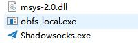
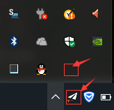
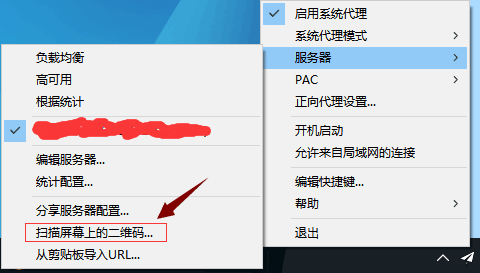
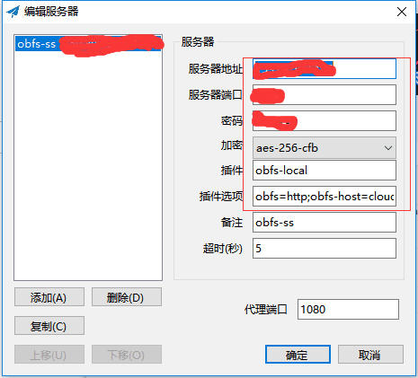
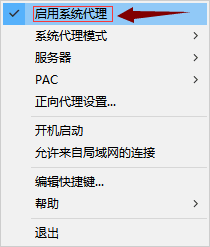

# Windows ss obfs配置教程
windows的shadowsocks obfs配置分以下几步，傻瓜式教程，操作1分钟内可搞定！

- 下载windows最新版的shadowsocks客户端、obfs客户端二合一压缩包
- 扫码配置ss账号，配置obfs混淆参数

## 下载新版客户端、obfs插件二合一压缩包并解压安装

- windows 最新版shadowsocks及obfs插件二合一压缩包
  - [zip压缩包下载](https://github.com/itrump/ssfree/raw/master/files/obfs_client/s-s.win.4.0.6.zip) 
  - [rar压缩包下载](https://github.com/itrump/ssfree/raw/master/files/obfs_client/s-s.win.4.0.6.rar)
- 解压到windows系统的任一文件目录下，得到3个文件：
  - 解压后文件列表，看到的可能是下面两种情况（带文件后缀名和不带）之一，不影响。
    - msys-2.0.dll
    - obfs-local.exe
    - Shadowsocks.exe
    - 或者无后缀形式：
    - msys-2.0
    - obfs-local
    - Shadowsocks
  - 解压后文件列表截图
    - 
- 打开shadowsocks.exe，可以看到任务栏或图标框中有个纸飞机.
  - 


## 扫码添加配置并配置obfs混淆

- 打开二维码页面（确保屏幕上只有一张二维码图片），右击「纸飞机」图标，弹出菜单中选「服务器」-> 「扫描屏幕上的二维码...」
  - 
  - 扫码成功后将弹出「配置详情」界面
  - 
- 配置混淆参数
  - 找到「配置详情」中的「插件」和「插件选项」，配置以下值并点「确定」保存：
    - 「插件」:```obfs-local```
    - 「插件选项」:```obfs=http;obfs-host=cloudfare.net```
  - **注意：以上两项不能有多余的空格或其他符号！原样复制进去就行，注意别复制两端的空格！否则连不上也不会报错误原因！**
  - 「备注」可自己任意填写，「超时」、「代理端口」保留默认值。

- 开启系统代理
  - 这一步很重要！右击「纸飞机」图标，找到最上面「启用系统代理」选项，点击勾选。
  - 

- 打开浏览器，看看谷歌是不是可以访问了？骚年，开始畅游世界互联网吧！
  - 


## 高阶用户自助优化
待更新

## [联系我们](./联系我们.md)
