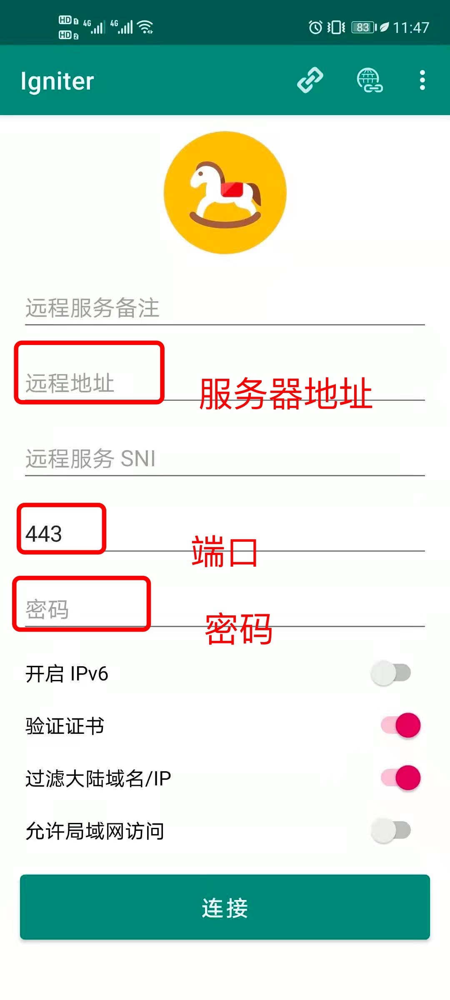

# Android Trojan 配置教程

> 说明：下载安装trojan-qt5 android客户端后，打开trojan-qt5扫码或手动填入服务器地址、端口、密码连接即可使用

注意事项：

- 请关闭并退出其他代理软件，以免干扰，导致配置失败、使用异常

- 手动填写配置，请确保填写的配置项每个字符都正确！并且首尾无多余空格！

##### 客户端下载

- [github trojan-qt5 android 客户端](https://github.com/trojan-gfw/igniter/releases/download/v0.10.3-beta/io.github.trojan_gfw.igniter-v0.10.3-beta-230001003-universal-release.apk)
- [备用线路trojan-qt5 android 客户端](http://www.trojanfree.com/files/client/troj/igniter-v0.10.3.apk)

##### Android如何配置trojan服务器账号

###### 1. 安装Android trojan客户端

- 退出其他代理软件如shadow-socks或shadow-socksr, vpn等
- 从上面链接下载好客户端，看到一个名为 `igniter-v0.10.3.apk`文件，打开并安装。安装成功后看到一个小马驹的图标。

###### 2. 配置 trojan服务器账号

可以扫码添加配置，或手动添加配置。

- 2.1 扫码添加配置

  - 打开应用。点击右上角菜单，选择『加载配置』

  - 菜单选项点击『加载配置』
    - 
  - 来到一个空页面，右上角有一个二维码的按钮。点击。

    - 
  - 从服务商获取`trojan`服务器二维码，并保存在系统相册。
  - 打开应用后选择『从相册读取二维码』
    - 

- 选择上面保存的服务器二维码，点击右上方『√』确认选择照片。
  - 
- 扫码成功后，如下图。可以看到自动添加的服务器。点击该条目，可选择使用该服务器。
  - 

- 2.2 手动添加配置
  - 打开应用后，主界面直接添加『服务器地址』、『端口』、『密码』三项，右上角三个点的菜单点击后选择『保存配置』
    - 
  - 手动添加配置，请注意手动填写的三项每个都一字不差，特别提醒不能有多余的空格！！！否则会导致连不上服务器，而且不容易找到问题所在！

###### 3. 启动trojan代理网络流量

- 打开应用，主页右上方三个点的菜单，点开后-> 『加载配置』->『扫码添加配置』-> 『选择服务器条目』，进入主界面。或手动添加配置，直接停留在主界面。如下图。
  - 
- 确认『服务器地址』、『端口』、『密码』已经填好了（手动或扫码填充），可以自行在第一行添加一个服务器备注如`my-tj-server`，其他选项在保持默认。点击『连接』
- 第一次会出现一把小钥匙的提示对话框，点击『确定』
  - 

配置完成，安卓状态栏上会出现一把小钥匙的图标，说明已经成功启动。

用浏览器打开https://www.google.com 看看，是不是可以的看外面的世界了吧！如果不能，请从头开始是不是哪一步漏了或没做对。
