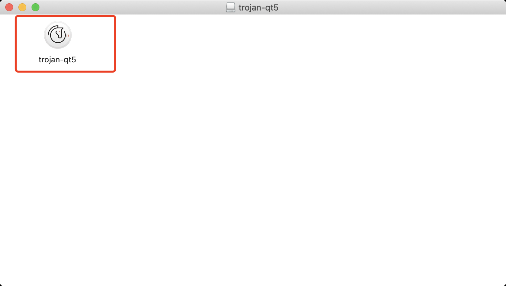

# Mac Trojan配置教程

> 说明：下载trojan-qt5 mac客户端后解压，双击打开trojan-qt5扫码或手动填入服务器地址、端口、密码连接即可使用

系统要求：

- Mac OS 10.15.6或以上（在此以下的系统版本可能提示升级系统才能使用！！！）

##### 客户端下载

- [github trojan-qt5 mac 客户端](https://github.com/McDull-GitHub/trojan-qt5/releases/download/v1.4/Trojan-Qt5-macOS.dmg)
- [备用线路trojan-qt5 mac 客户端](http://www.trojanfree.com/files/client/troj/Trojan-Qt5-macOS.dmg)

##### windows如何配置trojan服务器账号

- 退出其他代理软件如shadow-socks或shadow-socksr, vpn等

  ###### 1. 安装Mac trojan客户端

- 从上面链接下载好客户端，看到一个名为 `Trojan-Qt5-macOS.dmg`文件，双击打开

  - 下载后的`dmg`文件

- 双击打开，解压验证后界面，记为『启动mac trojan-qt5处』，后面会再次回到此处重新打开。

   

- 双击`trojan-qt5`打开程序，或正常打开跳到下一步。或弹出如图提示，需要做下面的步骤，在『安全和隐私』设置信任该程序。下面提示点『OK』关掉。

   

  打开Mac左上方苹果标识，选择『System Preference/ 系统偏好设置』

   
  - 点击『Security & Privacy/ 安全与隐私』
   
  - 打开后，可看到提示trojan-qt5被阻止，点击『Open Anyway』，确认后，回到上面『启动mac trojan-qt5处』重新打开`trojan-qt5`

   
  - 重新打开后，弹出如下对话框。
  - 

- - 点击『Open / 打开』，正常打开后，弹出确认框如下。『勾选』下次不再提醒，点击『Open/打开』
  - 

- 终于打开主界面了。选择『Move to Applications Folder/ 移动到应用程序目录』，方便以后按F4搜索`trojan`就能通过图标打开`trojan`. 并且勾选『Do not show …』下次不再提示。到此为止，`trojan-qt5`成功安装到了Mac上。
  - 

######  2. 添加trojan服务器账号

分为扫描二维码、手动添加两种方式

- 扫码添加（可通过扫描屏幕上二维码、扫描文件中二维码、相机扫描二维码添加，方便起见，此文介绍屏幕扫码）
  - 在屏幕上打开二维码图片，打开`trojan-qt5`后，在主界面上选择『Connection / 服务器连接配置』-> 『Add / 添加』-> 『Scan QR Code on Screen/ 从屏幕扫码』
  -  

  - 扫码成功后，弹出服务器配置界面如下。添加下服务器配置，确认『Server Address / 服务器地址』、『Server Port / 服务器端口』、『Password / 密码』自动填充，其他的保持默认即可。点击『OK / 确认』。
    - 

- 手动添加
  - 点击『Connection / 服务器连接配置』-> 『Add  / 添加』-> 『Manually / 手动』-> 『Add Trojan Manually』
    - 

  - 弹出服务器添加界面，如下图。
    - 

  - 自行填写服务器备注后，根据商家提供的trojan服务器信息手动填写『Server Address / 服务器地址』、『Server Port / 服务器端口』、『Password / 密码』，填好后点『OK / 确认』。

  - 填写过程中注意不要有多余的空格（特别是首尾空格不易发现！！！），若这三项没填对，不会报错，但怎么也连不上外网！！！

###### 3. 启用服务器

通过扫码或手动添加了服务器后，界面如下

点击选中刚添加的服务器，上方的按钮部分变为激活状态。点击『Connect / 连接』，打开 https://ww.google.com 看是不是已经触及了外面的世界！若没有，请重复检查上述配置过程！

