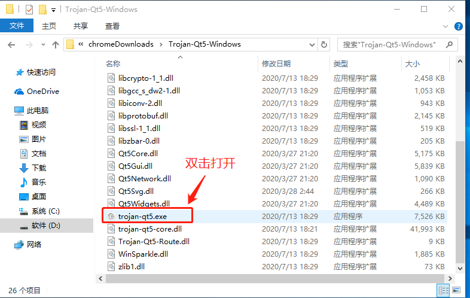
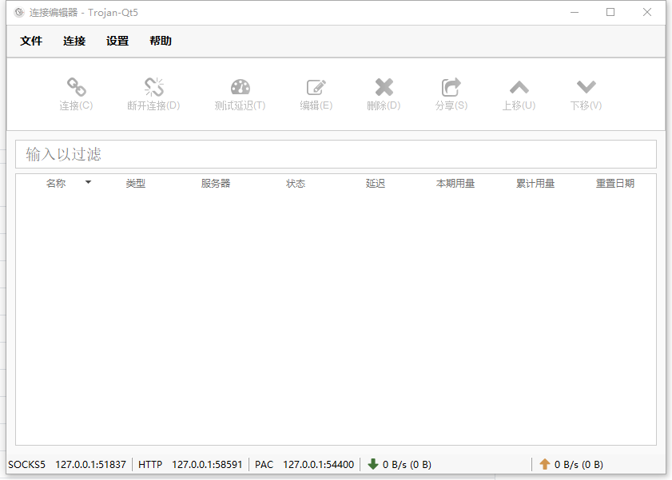
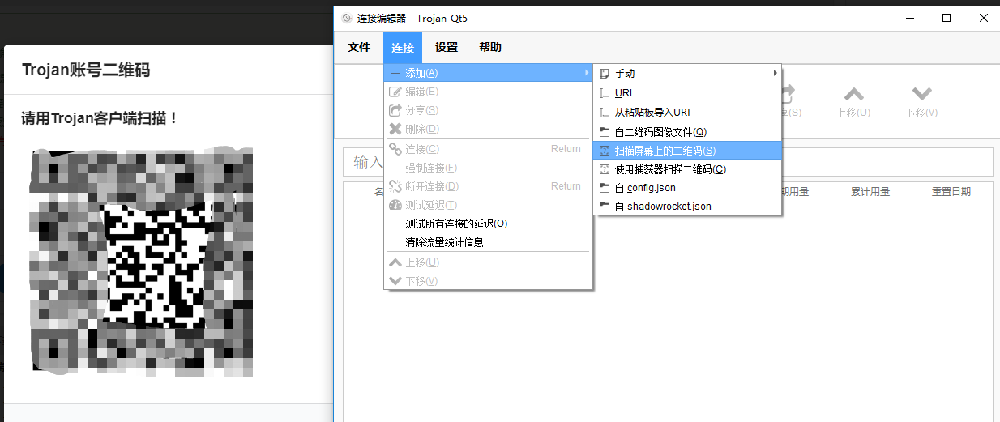
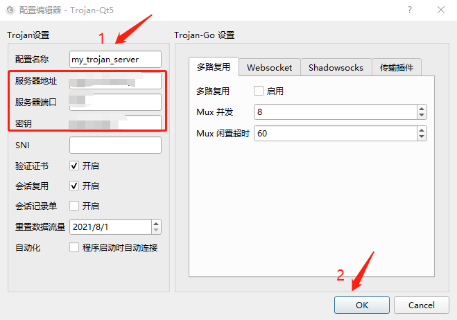
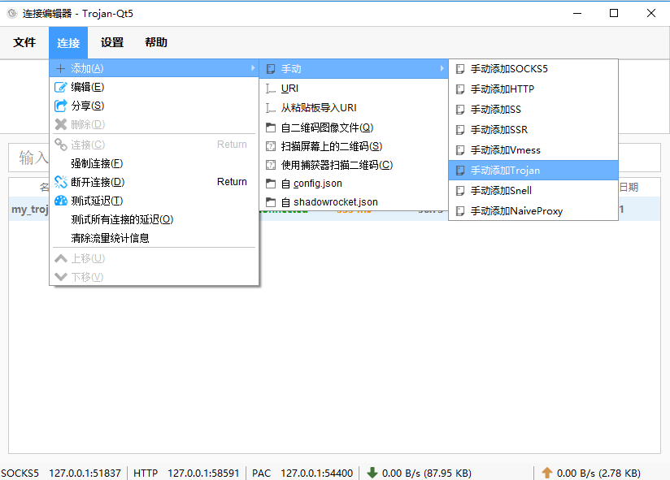
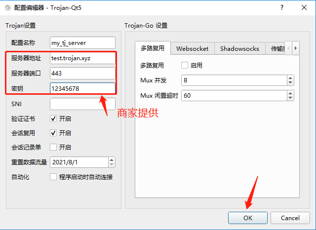
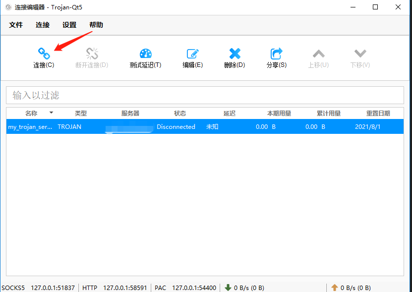
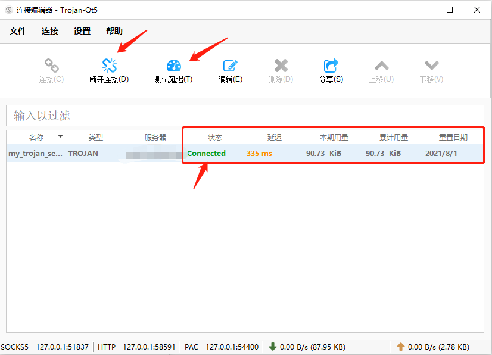

# Windows trojan 配置教程

> 说明：下载trojan-qt5 windows客户端后解压，双击打开trojan-qt5.exe扫码或手动填入服务器地址、端口、密码连接即可使用

注意事项：

- 请关闭并退出其他代理软件，以免干扰，导致配置失败、使用异常

##### 客户端下载
 - [github trojan-qt5 windows 客户端](https://github.com/McDull-GitHub/trojan-qt5/releases/download/v1.4/Trojan-Qt5-Windows.zip)
 - [备用线路trojan-qt5 windows客户端](http://www.trojanfree.com/files/client/troj/Trojan-Qt5-Windows.zip)

##### windows如何配置trojan服务器账号
 - 退出其他代理软件如shadow-socks或shadow-socksr, vpn等
 - 从上面链接下载好客户端，解压到新的文件夹。可以看到有个trojan-qt5.exe可执行文件，双击打开

解压后文件夹：

双击打开后界面：

 - 若打开过程中，杀毒软件弹出提示，属于误报，请选择信任并放行，否则无法使用。

成功打开后，可通过两种方式添加trojan服务器配置：

   - 通过二维码添加服务器配置

     - 登录商家网站，打开trojan账号的二维码放在屏幕中央。点击「连接」->「添加」->「扫描屏幕上的二维码」

     

     - 扫码后，出现服务器详细配置界面。1处给服务器账号加个备注如：香港线路01。确认`服务器地址`、`服务器端口`、`密钥`自动填充好了后，点击「OK」

     

   - 手动填写服务器配置

     - 登录商家网站，查看trojan账号信息。
     - 点击「连接」->「添加」->「手动」->「手动添加trojan」
     - 
     - 
     - 确认服务器账号信息无误后，点击「OK」保存

 - 扫码或手动添加trojan服务器后，在主界面出现trojan服务器配置条目。点击「连接」

 - 

 - 在浏览器中打开https://www.google.com 看看是否能正常访问，如果不能访问请再次确认上述步骤。

##### 其他操作

- 测试延时。点击「测试延时」可查看服务器延时

  

- 断开连接。点击「断开连接」不再使用trojan代理。

##### TODO

- [ ] 全局PAC配置说明
- [ ] FAQ
